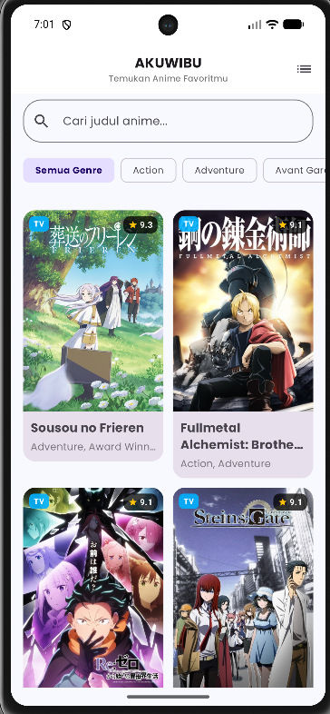
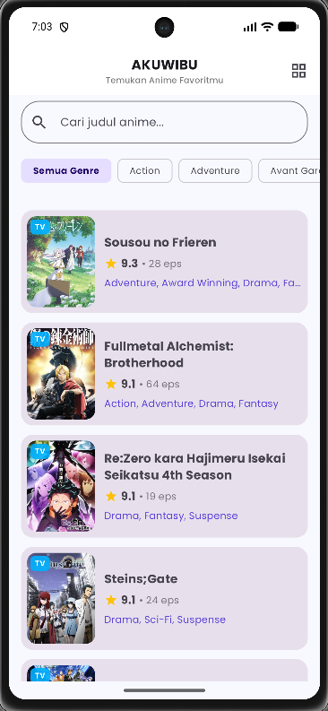
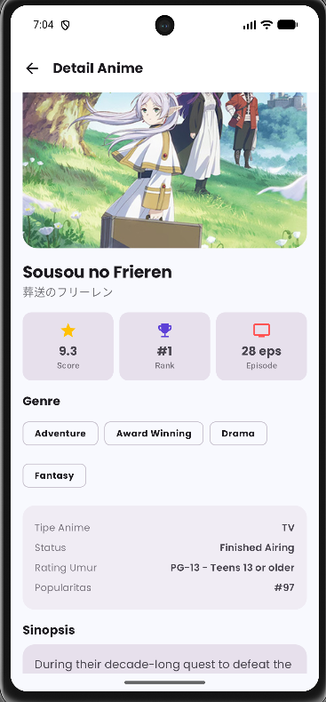

# AKUWIBU - Aplikasi Pencarian & Eksplorasi Anime
### Rinaldi - H1D024065 Praktikum Mobile Shift G

**AKUWIBU** (Responsi 1 Pemmob - *"Pipit Pengen Nonton Anime"*) adalah aplikasi mobile Android modern yang dibangun menggunakan **Kotlin**, **Jetpack Compose**, **Material Design 3**, dan arsitektur **MVVM (Model-View-ViewModel)**. Aplikasi ini memungkinkan pengguna untuk mengeksplorasi anime populer, melakukan pencarian berdasarkan judul, menyaring anime berdasarkan genre, serta melihat informasi detail anime secara interaktif dan dinamis dari REST API.

---

## Features & Highlights

- **Pencarian Real-time**: Mencari anime berdasarkan judul dengan *typing debounce*.
- **Filter Genre**: Menyaring anime berdasarkan kategori genre (Action, Comedy, Fantasy, Romance, Sci-Fi, dll.).
- **Multi-Layout View**: Beralih antara tampilan **Grid (2 Kolom)** dan **List** dengan mudah.
- **Halaman Detail Lengkap**: Menampilkan skor rating, jumlah episode, status penayangan, peringkat, kategori genre, serta sinopsis lengkap.
- **State-Driven UI**: Penanganan state UI yang responsif untuk **Loading**, **Success**, **Error**, dan **Empty State**.
- **Resilient Networking**: Dilengkapi dengan *Automatic Fallback Interceptor* pada layer HTTP network.

---

## Screenshots & GIF Demo
**Home Screen Grid & List**





---

## Penjelasan Arsitektur MVVM

Aplikasi ini menerapkan arsitektur **MVVM (Model-View-ViewModel)** yang bersih (*Clean Architecture principles*), memisahkan *UI Logic*, *Business Logic*, dan *Data Logic*:

```
com.pemmob.responsi1pemmob/
├── data/
│   ├── model/         # [MODEL] Data Class penampung JSON API
│   ├── remote/        # [NETWORK] Retrofit Client & API Interface
│   └── repository/    # [REPOSITORY] Sumber data utama (Data Abstraction Layer)
└── ui/
    ├── components/    # [VIEW] Reusable Composable Widgets (AnimeCard, StateViews, dll.)
    ├── navigation/    # [VIEW] NavHost & Graph Navigasi Halaman
    ├── screen/        # [VIEW] Jetpack Compose Screen (HomeScreen & DetailScreen)
    ├── state/         # [STATE] Sealed Interface UI State Management
    ├── theme/         # [DESIGN] Custom Color Palette, Typography & M3 Theme
    └── viewmodel/     # [VIEWMODEL] Pengelola state & logika bisnis UI
```

### Komponen Arsitektur:

1. **Model (`data/model/AnimeModel.kt`)**:
   - Berisi `data class` Kotlin (`Anime`, `Genre`, `AnimeResponse`, `AnimeDetailResponse`, dll.) yang memetakan respon JSON dari REST API secara *null-safe*.

2. **Repository (`data/repository/AnimeRepository.kt`)**:
   - Bertindak sebagai *single source of truth* untuk mengambil data anime dari jaringan menggunakan `Dispatchers.IO` coroutine context dan mengembalikan objek `Result<T>`.

3. **ViewModel (`ui/viewmodel/`)**:
   - `AnimeViewModel`: Mengelola `StateFlow` untuk *query* pencarian, *selected genre*, mode layout (*Grid vs List*), serta `AnimeUiState` (`Loading`, `Success`, `Error`).
   - `AnimeDetailViewModel`: Mengelola pengambilan data detail anime berdasarkan `animeId`.

4. **View / UI (`ui/screen/` & `ui/components/`)**:
   - Dibuat secara deklaratif menggunakan **Jetpack Compose** dan **Material 3**. UI bersifat *state-driven* (bereaksi secara otomatis terhadap perubahan state pada `StateFlow` ViewModel).

---

## Penjelasan Penggunaan API

Aplikasi mengambil data anime secara dinamis menggunakan **Tenrai REST API** (`https://api.tenrai.org/v1/`) yang kompatibel dengan format MyAnimeList:

### Endpoints yang Digunakan:

| Function | Method | Endpoint | Deskripsi |
| :--- | :--- | :--- | :--- |
| **Top Anime** | `GET` | `/v1/top/anime` | Mengambil daftar anime terpopuler / rating tertinggi. |
| **Search & Filter** | `GET` | `/v1/anime?q={query}&genres={genreId}` | Pencarian anime berdasarkan kata kunci judul dan/atau ID genre. |
| **Detail Anime** | `GET` | `/v1/anime/{id}` | Mengambil informasi detail rinci anime berdasarkan ID (`mal_id`). |
| **Daftar Genre** | `GET` | `/v1/genres/anime` | Mengambil daftar kategori genre anime untuk filter chips. |

## Automatic Network Fallback (Resiliency):
Aplikasi dilengkapi dengan `FallbackInterceptor` pada OkHttp client. Jika hostname `api.tenrai.org` tidak dapat di-resolve (*DNS error/offline*), OkHttp akan secara otomatis mengalihkan *request* ke server backup `https://api.jikan.moe/v4/` sehingga aplikasi tetap berjalan tanpa error.

---

## Teknologi & Library yang Digunakan

- **Bahasa**: [Kotlin](https://kotlinlang.org/)
- **UI Toolkit**: [Jetpack Compose](https://developer.android.com/jetpack/compose) & [Material Design 3](https://m3.material.io/)
- **Navigation**: [Navigation Compose](https://developer.android.com/jetpack/compose/navigation)
- **Networking**: [Retrofit 2](https://square.github.io/retrofit/) & [OkHttp 4 Logging Interceptor](https://square.github.io/okhttp/)
- **JSON Parser**: [Gson Converter](https://github.com/google/gson)
- **Image Loading**: [Coil Compose](https://coil-kt.github.io/coil/)
- **Asynchronous**: [Kotlin Coroutines](https://kotlinlang.org/docs/coroutines-overview.html) & [StateFlow](https://kotlinlang.org/api/kotlinx.coroutines/kotlinx-coroutines-core/kotlinx.coroutines.flow/-state-flow/)

---

## Cara Menjalankan Aplikasi

1. Clone repository ini:
   ```bash
   git clone https://github.com/username/Responsi1Pemmob.git
   ```
2. Buka proyek di **Android Studio** (Hedgehog / Ladybug atau versi terbaru).
3. Pastikan perangkat Android / Emulator terhubung dengan koneksi internet.
4. Klik tombol **Run 'app'** (`Shift + F10`) di Android Studio.
